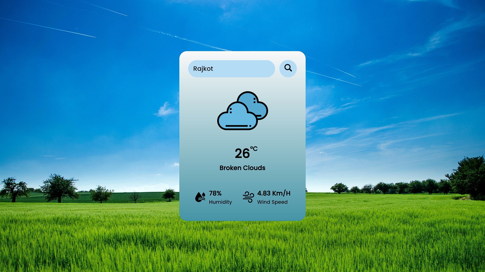

# Weather App

This is a simple weather application that allows users to search for weather conditions in any city. It provides details such as temperature, weather description, humidity, and wind speed. The application also dynamically changes its style based on whether it’s day or night at the selected location.

## Features

- **Search for city weather**: Enter a city name to retrieve real-time weather data.
- **Day/Night Mode**: Automatically switches between day and night styles depending on the location's time.
- **Weather Details**: Displays the temperature, weather conditions, humidity percentage, and wind speed.
- **Error Handling**: Shows a "Location not found" message if the city is not found.

## Technologies Used

- **HTML5**: For the structure and layout of the web page.
- **CSS3**: For styling and animations, including the dynamic change between day and night themes.
- **JavaScript**: Handles the API requests and user interactions.
- **OpenWeather API**: Used to fetch real-time weather data.
- **TimeZoneDB API**: Fetches the timezone information to determine whether it's day or night.

## Screenshots



## Setup Instructions

1. **Clone the repository**:
   ```bash
   git clone https://github.com/yourusername/weather-app.git
   cd weather-app
   ```

2. **Get API keys**:
   - Sign up for a free API key from [OpenWeather](https://openweathermap.org/) and [TimeZoneDB](https://timezonedb.com/).
   - Replace the placeholder keys in the `script.js` file:
     ```js
     const weatherappid = "YOUR_OPENWEATHER_API_KEY";
     const timezoneappid = "YOUR_TIMEZONEDB_API_KEY";
     ```

3. **Open the project**:
   - Open `index.html` in your browser to start the application.

## How It Works

1. The user enters the name of a city and clicks the search button.
2. The app fetches weather data from the OpenWeather API based on the city entered.
3. It also retrieves the timezone data using the TimeZoneDB API to determine whether it's day or night in that city.
4. Based on the time, the app changes its appearance (background color and image) to either a day or night theme.
5. Weather details such as temperature, humidity, wind speed, and weather conditions are displayed dynamically.

## Project Structure

```bash
├── index.html        # Main HTML file
├── style.css         # Stylesheet for the app
├── script.js         # Main JavaScript logic
├── img/              # Folder containing images for weather icons and backgrounds
```

## Future Enhancements

- Add support for different languages.
- Provide a weekly weather forecast.
- Improve mobile responsiveness.
